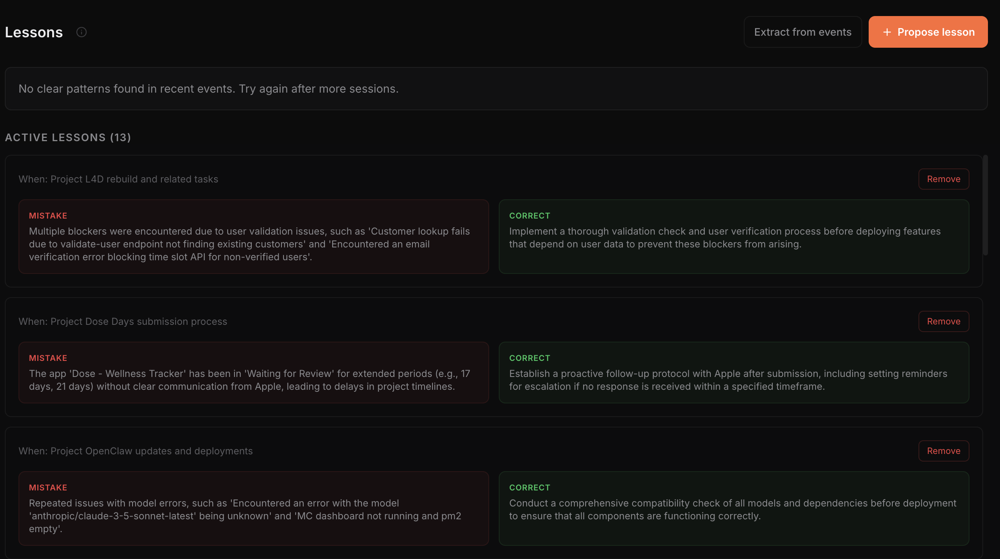
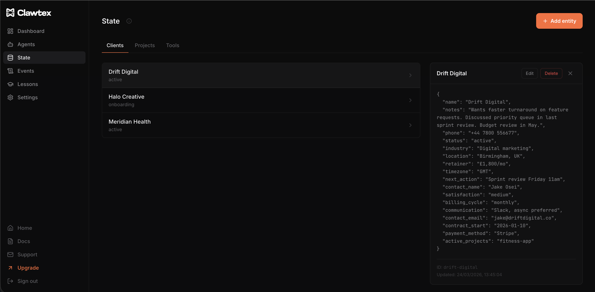
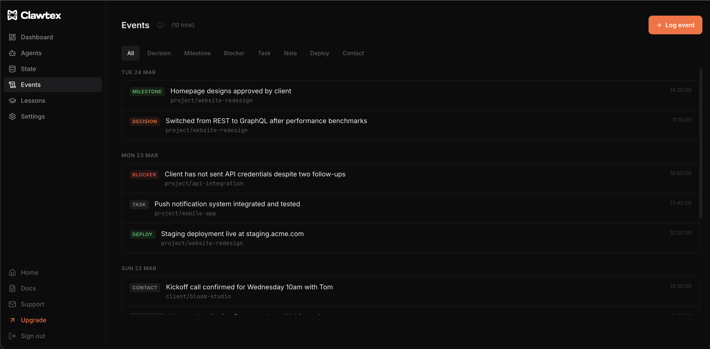
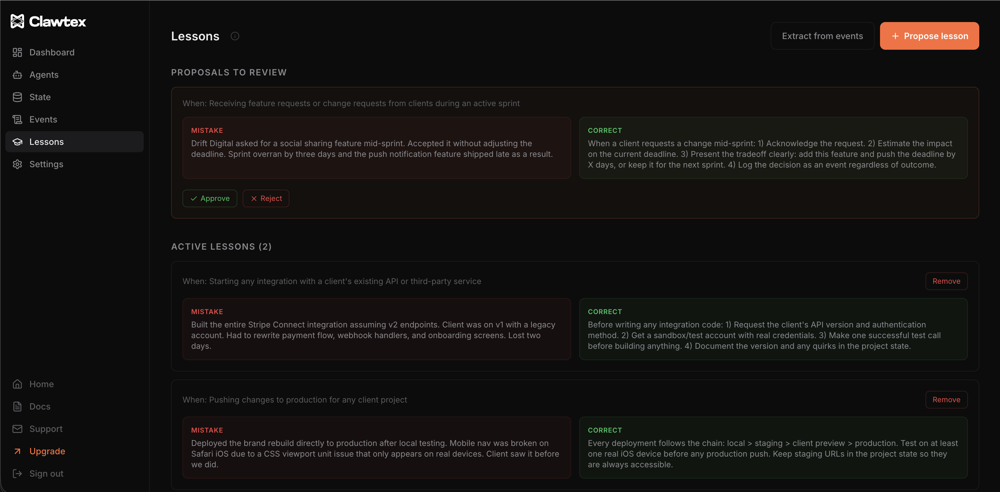
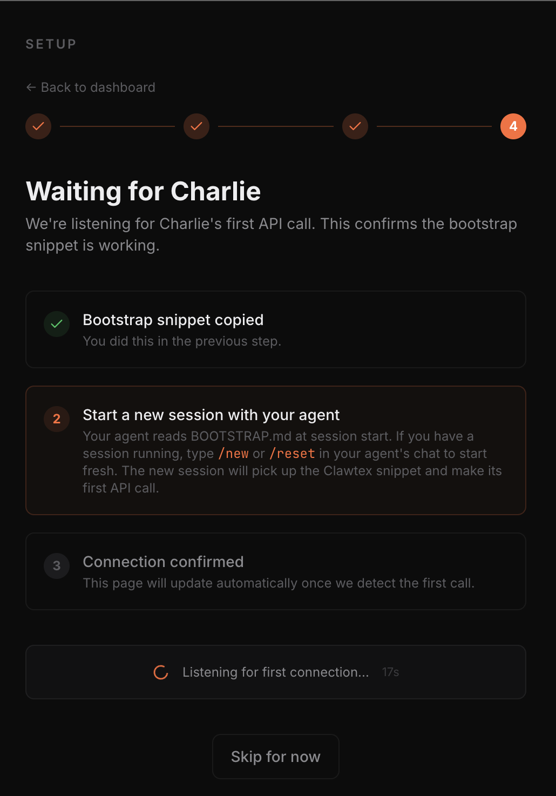
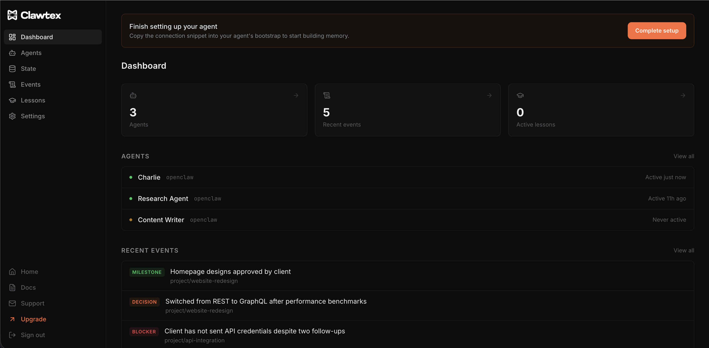
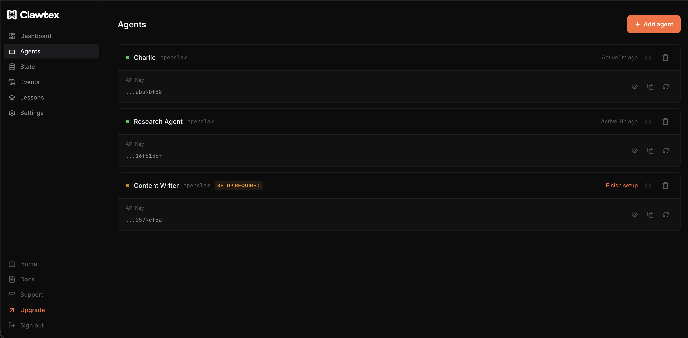
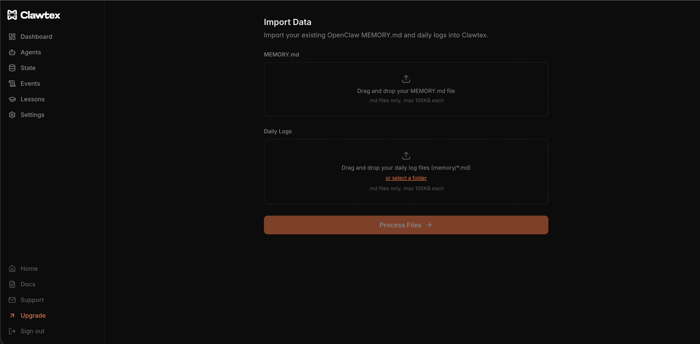

<h1 align="center">Clawtex</h1>
<p align="center"><strong>Structured memory for AI agents. Your agent remembers everything.</strong></p>

<p align="center">
  <a href="https://clawtex.io">Website</a> · <a href="docs/getting-started.md">Getting Started</a> · <a href="docs/api-reference.md">API Reference</a> · <a href="docs/bootstrap-guide.md">Bootstrap Guide</a>
</p>

---

<p align="center">
  
</p>

Every AI agent session starts from zero. Context gets lost. Decisions get repeated. Lessons never stick.

**Clawtex gives your [OpenClaw](https://openclaw.ai) agent three layers of persistent memory:**

## State — what exists right now

Clients, projects, tools, repos. Structured, queryable, always current. Your agent reads state at every session start and updates it as things change.



## Events — what happened

Decisions, milestones, blockers, tasks, deployments. Each event is timestamped, typed, and linked to an entity. Full history, fully queryable.



## Lessons — what to do differently

Patterns extracted from your event history. Mistakes identified, corrections proposed, lessons injected at every session start. Your agent improves. Weekly, automatically.



---

## Quick Start

1. Sign up at [clawtex.io](https://clawtex.io)
2. Create an agent and copy your snippet
3. Add this to your agent's `BOOTSTRAP.md`:

```bash
CLAWTEX=$(curl -s -H "Authorization: Bearer YOUR_API_KEY" \
  https://clawtex.io/api/bootstrap)
echo "$CLAWTEX"
```

Start a new session. Your agent now has persistent memory.



---

## One Snippet. Every Plan.

The bootstrap snippet is the same for all plans. The API adapts the response based on your tier:

- **Free** — State and read-only rules
- **Pro** — State, lessons, recent events, automatic event logging, context checkpoints
- **Team** — Everything in Pro, plus multi-agent attribution

When you upgrade, your agent gets the expanded response on its next session. No snippet changes needed.

---

## Dashboard

Manage your agents, browse state, review events, and approve lessons from one place.



### Agents

Connect multiple agents. Each gets its own API key with reveal, copy, and regenerate controls.



### Import

Already using OpenClaw? Import your existing `MEMORY.md` and daily logs. Your dashboard is populated from day one.



---

## How It Works

```
Session starts
    |
Agent calls /api/bootstrap
    |
Clawtex returns: state + lessons + rules + recent events
    |
Agent works with full context
    |
Agent logs events as they happen
    |
Weekly: Clawtex extracts lessons from event patterns
    |
Next session: agent starts smarter than last time
```

---

## Documentation

| Guide | Description |
|-------|-------------|
| [Getting Started](docs/getting-started.md) | Sign up, connect your agent, first session |
| [API Reference](docs/api-reference.md) | All endpoints, auth, rate limits |
| [Bootstrap Guide](docs/bootstrap-guide.md) | Tier responses, checkpoints, upgrading |

---

## Plans

| | Free | Pro | Team |
|---|---|---|---|
| **Price** | £0/mo | £9/mo | £24/mo |
| **Agents** | 1 | 3 | Unlimited |
| **Event history** | 7 days | Unlimited | Unlimited |
| **Dashboard** | Read-only | Full access | Full access |
| **Automatic logging** | — | ✓ | ✓ |
| **Lessons** | — | ✓ | ✓ |
| **Import** | — | ✓ | ✓ |

[Get started free →](https://clawtex.io/signup)

---

## Built for OpenClaw

Clawtex is designed specifically for [OpenClaw](https://openclaw.ai) agents. It integrates through your agent's `BOOTSTRAP.md` with a single API call at session start.

---

## Links

- **Website:** [clawtex.io](https://clawtex.io)
- **Support:** info@clawtex.io
- **OpenClaw:** [openclaw.ai](https://openclaw.ai)

---

## Licence

[Business Source License 1.1](LICENSE) — free for non-commercial use. Converts to MIT after four years.
